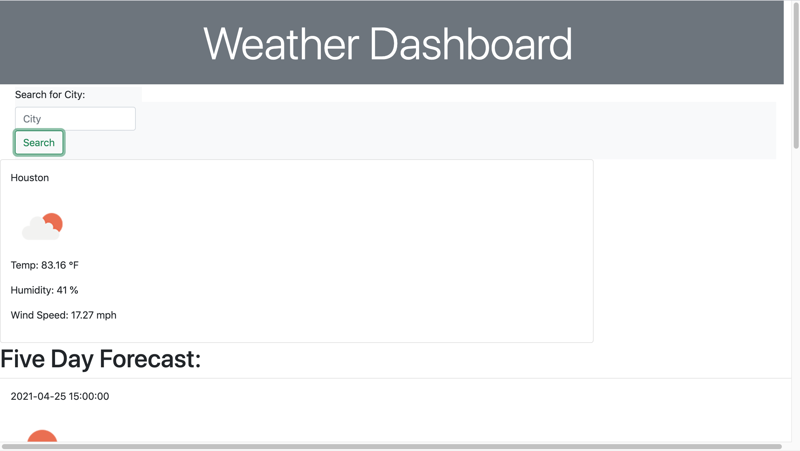

# WeatherDashboard
 
# **License:**
  ### MIT
  

  # **Table of Contents**

  *[Description](#description)

  *[Usage](#usage)

  *[Contributors](#guidelines)

  
  # **Description**
  ### I created a weather application using the Open Weather API. This application includes city name, the date, an icon representation of weather conditions,   the temperature, the humidity, the wind speed, and the UV index.
  
    
  
  # **Usage**
  ### For this specific project, the application is used to track weather in different cities.
  
   
  # **Contributors**
  ### This was created by Avi Mancillas.
  
  # **Links:**
  ### https://avmancillas.github.io/Week6HW/ 
  
  

